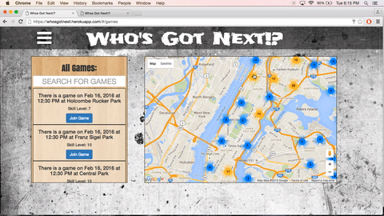

''

### About

> A MEAN-Stack application that incorporates Google Maps to allow users to find and create pickup basketball games at any one of the 552 public basketball courts in NYC.

### Technologies Used
1. AngularJS
2. MongoDB
3. Express
4. NodeJS
5. Google Maps
6. JavaScript

### User Stories
> When a user signs up they are required to specify on a scale of 1-10 how skilled they are at basketball. Then upon logging in they can view all future pickup games, games going on today, or games specific by each court. Each game lists the amount of players attending the game, and the average skill level of the game. The user can also create their own game where they specify the court, time, and date of the game.

### Future Features
> The next features I'd like to add to Who's Got Next would be to add friends and see what games they are playing, and allow invitations to join games between friends.  Another feature would be to have an option to find the closest game based on the users current geo-location.
